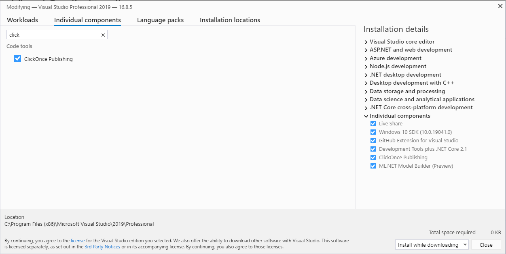
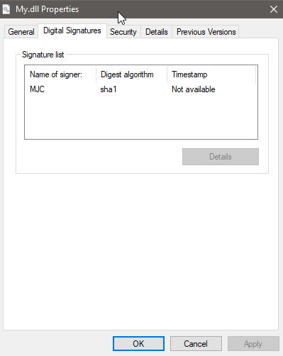

---
layout: post
title: Signing .NET assemblies with certificates - Windows edition
excerpt_separator: <!--more-->
author: Miha J.
tags: c# signing certificate pfx
---

Sometimes it's good to sign our assemblies with certificates. This way, we give away software that guarantees that did not change since it left our build pipelines. It can give our customers a safety net, that the assembly came from us (if the certificate is not compromised). Let's see how we can do that for .NET assemblies on the Windows system.

First, you need a `signtool.exe`, which comes with Visual Studio. Open `Visual Studio Installer` and modify your Visual Studio installation. Go to `Individual components` and add the `ClickOnce Publishing` package.



### 1. Singtool.exe
Once done, go to `C:\Program Files (x86)\Microsoft SDKs\ClickOnce\SignTool`, which should contain `singtool.exe`.

### 2. Get PFX certificate
If you already have a certificate in PFX format, you can continue to point 3.

Otherwise, generate or get the certificate from the certificate authority. You can use a test self-signed certificate [CertificateTools.com - Online X509 Certificate Generator](https://certificatetools.com/).

### 3. Sign assembly
Then you can easily run the command below to sign `C:\MyApp\My.dll`:

```powershell
> .\signtool.exe sign /f "c:\certs\cert.pfx" /p mypass "C:\MyApp\My.dll"
Done Adding Additional Store
Successfully signed: C:\MyApp\My.dll
```
- switch `/f` - specify a PFX certificate file
- switch `/p` - set a password for the certificate if protected.

### 4. Verify assembly
Let's check the `My.dll` properties where you can see our test certificate signs it.



We can also validate the assembly with `signtool.exe`.

```powershell
❯ signtool.exe verify /pa "C:\MyApp\My.dll"
File: C:\downloads\My.dll
Index  Algorithm  Timestamp
========================================
SignTool Error: A certificate chain processed, but terminated in a root
        certificate which is not trusted by the trust provider.

Number of errors: 1
```
If you get the message above, you need to install CA root certificate from PFX to your Windows certificate store and retry:

```powershell
❯ signtool.exe verify /pa "C:\MyApp\My.dll"
File: C:\MyApp\My.dll
Index  Algorithm  Timestamp
========================================
0      sha1       None

Successfully verified: C:\MyApp\My.dll
```
And this is how you can sign and verify assemblies with certificates.
