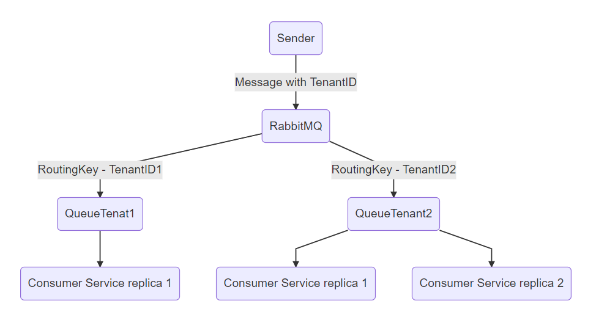

---
layout: post
title: MassTransit and RabbitMQ routing to tenant-specific consumers on .NET
excerpt_separator: <!--more-->
author: Miha J.
tags: masstransit, c#, rabbitmq
---

Imagine a situation where you have an application that has a multi-tenancy. The application has a service that can run in multiple replicas and is configured for a specific tenant.

You can imagine it something like the diagram below:



1. A Sender sends the message with a TenantID to RabbitMQ.
2. RabbitMQ routes the message to the queue that is specific for a particular tenant.
3. Consumer service picks up a message from the tenant queue and processes it. There can be multiple replicas under one tenant.

So how can we achieve that with [MassTransit framework](https://masstransit-project.com/)?

I've prepared a simple solution on [GitHub](https://github.com/mihaj/RabbitMQ.Routing), where you can download it and run it. Below is just the description of the essential parts of the solution - sending and receiving from the tenant-specific queue.

For sending, we are using MassTransit's `ISendEndpointProvider`, which specifies a sending endpoint to `consumerName` (the last part of the name is a `tenantId`).

```csharp
public class Sender
{
    private readonly ISendEndpointProvider _sendEndpoint;

    public Sender(ISendEndpointProvider sendEndpoint)
    {
        _sendEndpoint = sendEndpoint;
    }

    public async Task Publish(MyMessage resp)
    {
        string consumerName = $"{KebabCaseEndpointNameFormatter.Instance.Consumer<MyConsumer>()}-{resp.TenantId}";

        ISendEndpoint endpoint = await _sendEndpoint.GetSendEndpoint(
            new Uri($"queue:{consumerName}"));

        await endpoint.Send(resp);
    }
}
```

For receiving, we define a consumer, which implements `IConsumer<MyMessage>`.

```csharp
public class MyConsumer: IConsumer<MyMessage>
{
    public Task Consume(ConsumeContext<MyMessage> context)
    {
        Console.WriteLine(JsonConvert.SerializeObject(context.Message));

        return Task.CompletedTask;
    }
}
```

Also we need to configure the `receive endpoint` for MassTransit in the `Consumer` project. This is a configuration for the consumer, where we set the `tenantId` as a part of the queue name, set the `ExchangeType` to `Direct` and set the `RoutingKey` to the one defined in the configuration.
```csharp
var queueName = $"{KebabCaseEndpointNameFormatter.Instance.Consumer<MyConsumer>()}-{configuration["TenatId"]}";

configurator.ReceiveEndpoint(queueName, endpoint =>
{
    endpoint.ConfigureConsumeTopology = false;
    endpoint.Bind<MyMessage>(x =>
    {
        x.ExchangeType = ExchangeType.Direct;
        x.RoutingKey = configuration["TenatId"];
    });

    endpoint.ConfigureConsumer<MyConsumer>(context);
});
```

And that's it. To learn more and try it out, download the [GitHub solution](https://github.com/mihaj/RabbitMQ.Routing) and fill in bits and pieces yourself :).

